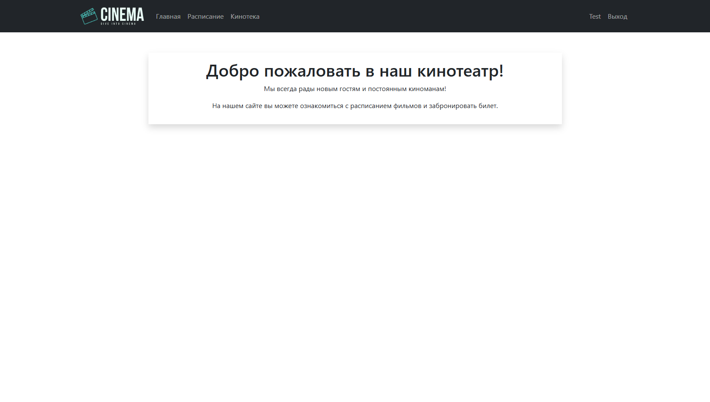
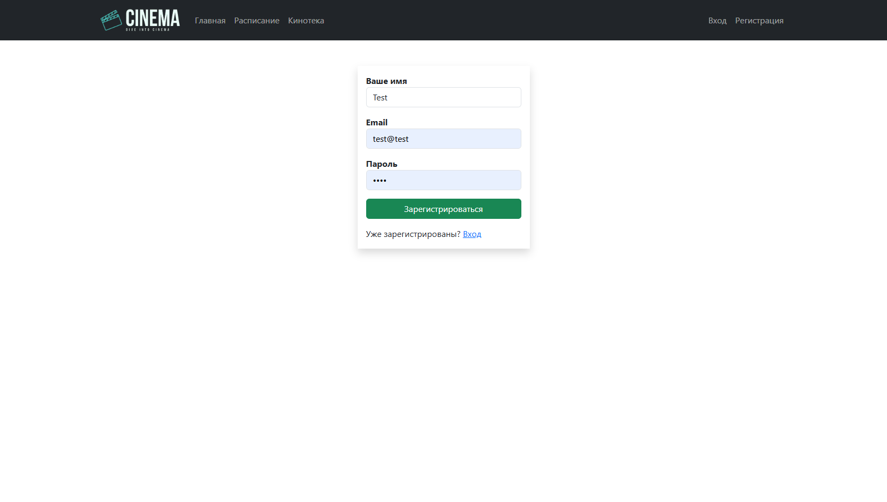
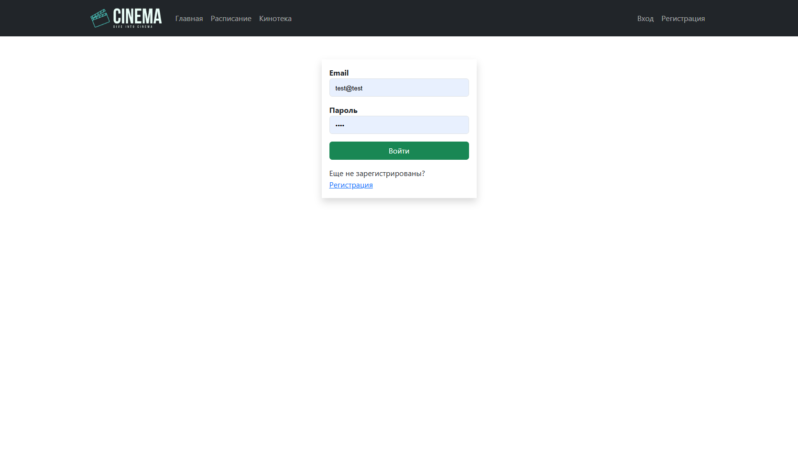
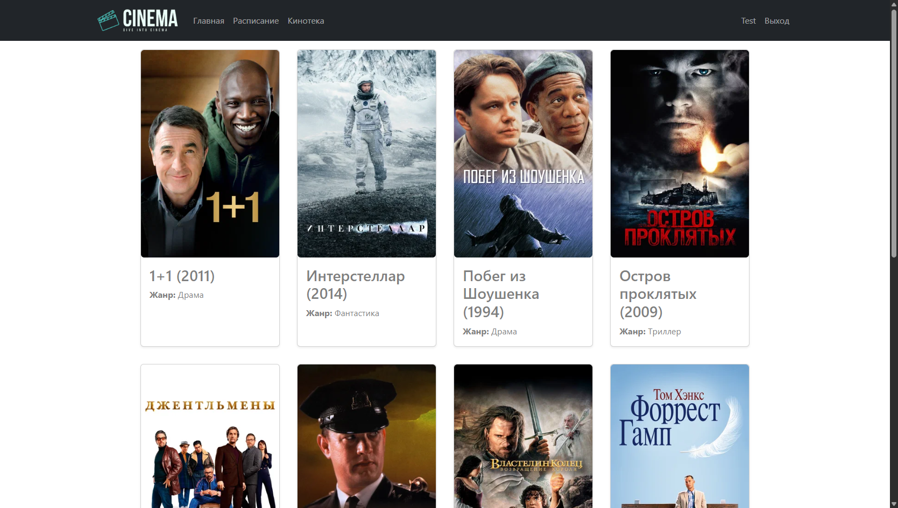
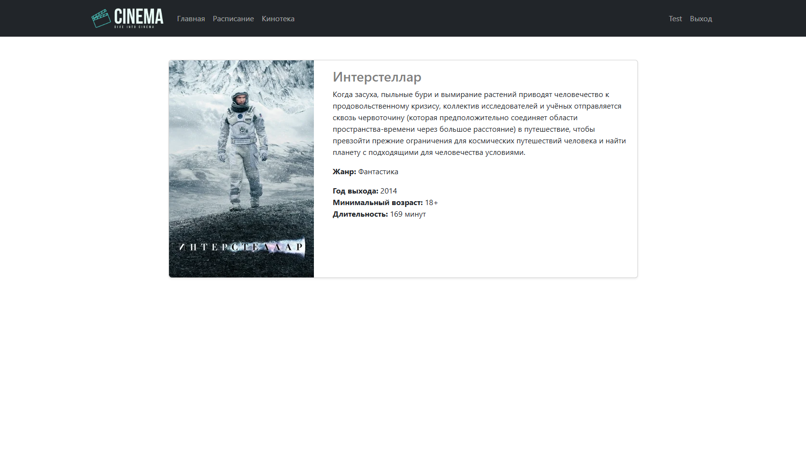
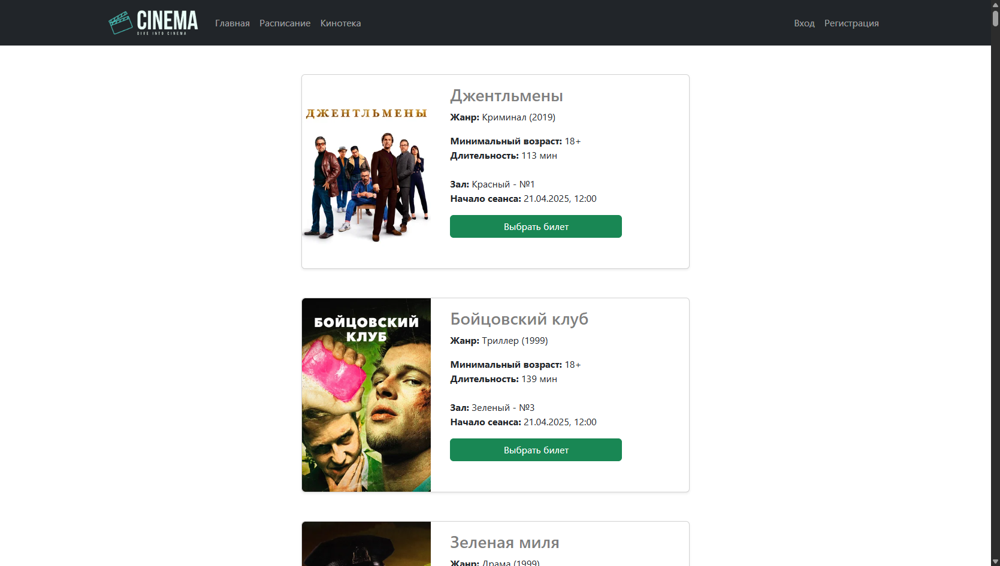
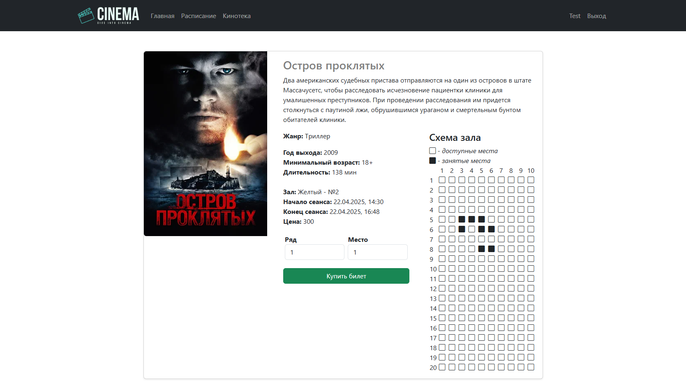

# job4j_cinema. Кинотеатр: Система покупки билетов

## Оглавление

- [О проекте](#о-проекте)
- [Стек технологий](#стек-технологий)
- [Требования к окружению](#требования-к-окружению)
- [Запуск проекта](#запуск-проекта)
- [Основные функции](#основные-функции)
- [Страницы приложения](#страницы-приложения)

## О проекте

Проект представляет собой веб-приложение для покупки билетов в кинотеатр. 
Основная цель — предоставить пользователям удобный интерфейс для
просмотра расписания киносеансов и фильмов, а также для покупки билетов.

## Стек технологий

- **Spring Boot**
- **Thymeleaf**
- **Bootstrap**
- **Sql2o**
- **Liquibase**
- **PostgreSQL**

## Требования к окружению

- **Java 17**
- **Maven 3.9**
- **PostgreSQL 17**

## Запуск проекта

1. **Клонируйте репозиторий:**

       git clone https://github.com/tasker312/job4j_cinema
       cd job4j_cinema

2. **Создайте базу данных:**

       create database cinema;

3. **Измените данные для подключения к базе данных:**

       db/liquibase.properties
       src/main/resources/application.properties

4. **Запустите приложение:**

       mvn spring-boot:run -Pproduction

5. **Откройте приложение в браузере:**

   Перейдите по адресу [http://localhost:8080](http://localhost:8080)

## Основные функции

- **Просмотр киносеансов и фильмов:** Страница с полным списком фильмов, доступных в кинотеатре, для удобного просмотра и выбора.
- **Регистрация и вход:** Пользователи могут создавать учетные записи и входить в систему для доступа к покупке билетов.
- **Покупка билетов:** Пользователи могут выбрать фильм, сеанс, ряд и место, а затем подтвердить покупку.

## Страницы приложения

### Главная страница

### Страница регистрации

### Страница авторизации

### Список фильмов

### Описание фильма

### Список сеансов

### Покупка билета

